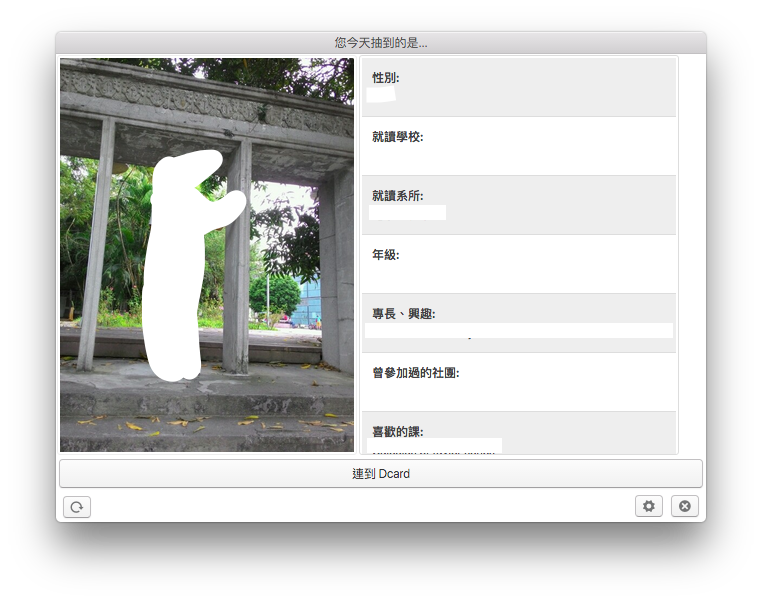
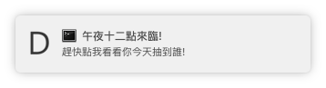

Dcard 抽卡快速看
==
A menubar helps you check what card of Dcard you get today!  
一個小工具讓你快速看你 Dcard 今天抽到的是誰。



# 功能
- 點開程式，立即查看抽到誰
- 提供連結至 Dcard 抽卡頁
- 午夜來臨，自動提醒  


# 下載
- [Window 安裝檔](https://github.com/lockys/dcard-bar/releases/download/0.0.2/dcard-bar-setup.exe)  
- [OS X app](https://github.com/lockys/dcard-bar/releases/download/0.0.2/dcard-card-bar.zip)

# 已知問題  
- PC-cillin 會擋
- 點多下 icon 會開啟多次

# 聲明
本程式保證不收集密碼 :pray:  
帳號密碼僅用來向 `https://www.dcard.tw/api/member/login` 發送登入請求，絕無其他用途。

公開程式碼:   
https://github.com/lockys/dcard-card/blob/master/lib/login.js#L2

# Build

```sh
$ git clone https://github.com/lockys/dcard-card-bar.git dcard-card-bar && cd dcard-card-bar
$ npm run build # package os x app
$ npm run build-win # package to win x64 executable.
$ npm run build-win-ia32 # package win x86 executable.
```

# Develop

**Install dependencies**
```sh
$ git clone https://github.com/lockys/dcard-card-bar.git dcard-card-bar && cd dcard-card-bar
$ npm install
```

**Run the bar!**
```sh
$ npm start # aka eletron .
```

# Contribution
Any PRs and complains are welcome!

# Built with

- [maxogden/menubar](https://github.com/maxogden/menubar)
- [connors/photon](https://github.com/connors/photon)
- [lockys/dcard-card](https://github.com/lockys/dcard-card)

# LICENSE
The MIT License (MIT)

Copyright (c) 2015 Hao-Weo Jeng

Permission is hereby granted, free of charge, to any person obtaining a copy
of this software and associated documentation files (the "Software"), to deal
in the Software without restriction, including without limitation the rights
to use, copy, modify, merge, publish, distribute, sublicense, and/or sell
copies of the Software, and to permit persons to whom the Software is
furnished to do so, subject to the following conditions:

The above copyright notice and this permission notice shall be included in all
copies or substantial portions of the Software.

THE SOFTWARE IS PROVIDED "AS IS", WITHOUT WARRANTY OF ANY KIND, EXPRESS OR
IMPLIED, INCLUDING BUT NOT LIMITED TO THE WARRANTIES OF MERCHANTABILITY,
FITNESS FOR A PARTICULAR PURPOSE AND NONINFRINGEMENT. IN NO EVENT SHALL THE
AUTHORS OR COPYRIGHT HOLDERS BE LIABLE FOR ANY CLAIM, DAMAGES OR OTHER
LIABILITY, WHETHER IN AN ACTION OF CONTRACT, TORT OR OTHERWISE, ARISING FROM,
OUT OF OR IN CONNECTION WITH THE SOFTWARE OR THE USE OR OTHER DEALINGS IN THE
SOFTWARE.
